# WCFProject - Multiplayer Mono**Game**

## Overview

WCFProject is my provate lab project of creating full-featured game based on .NET WCF communication, MonoGame framework and physics engine. The result is server-client game application with ability to serve multiple client instances.

## Documentation

Full documentation in Polish language is available [here](docs/WCFProject_Documentation_PL.docx) in DOCX format.

## Frameworks and libraries

- Microsoft .NET Framework 4.5;
- Windows Presentation Foundation (WPF);
- Windows Communication Foundation (WCF);
- MonoGame;
- Farseer Physics Engine (Box2D);
- Json.NET;
- TiledSharp;
- MahApps.Metro;

## Screenshots

### Client

Client 1 | Client 2
:---: | :---:
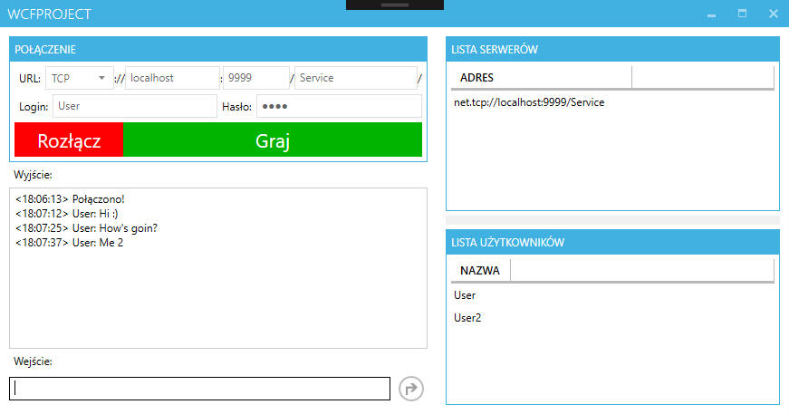 | 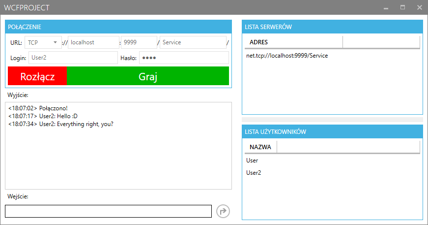
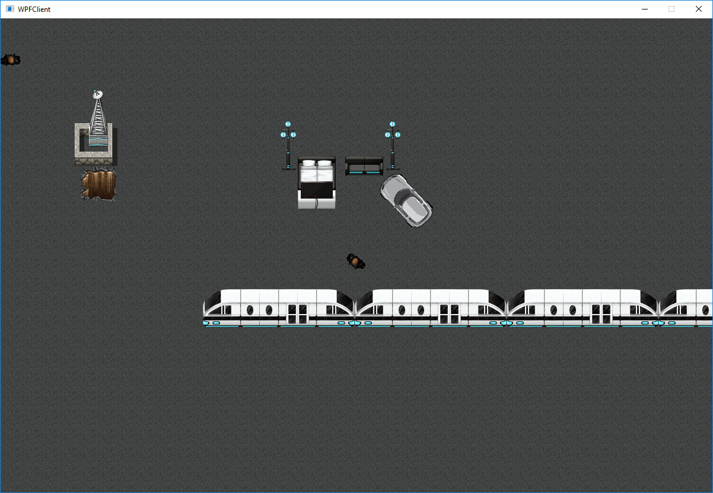 | 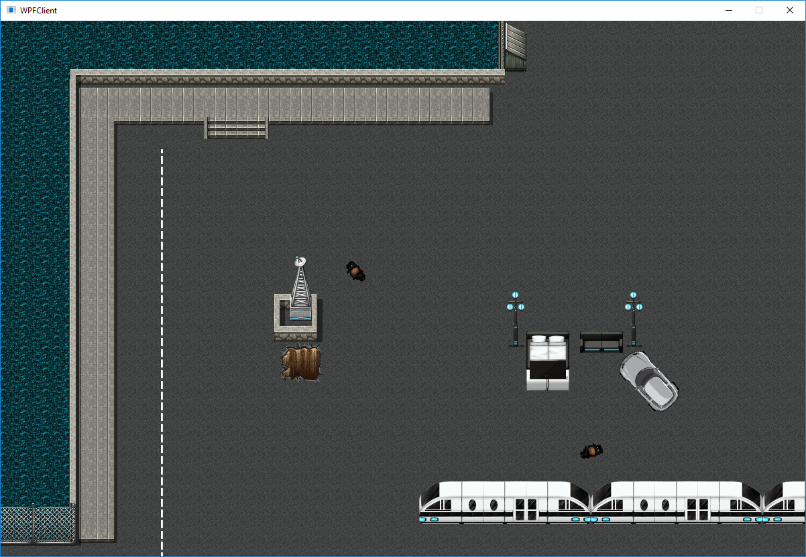
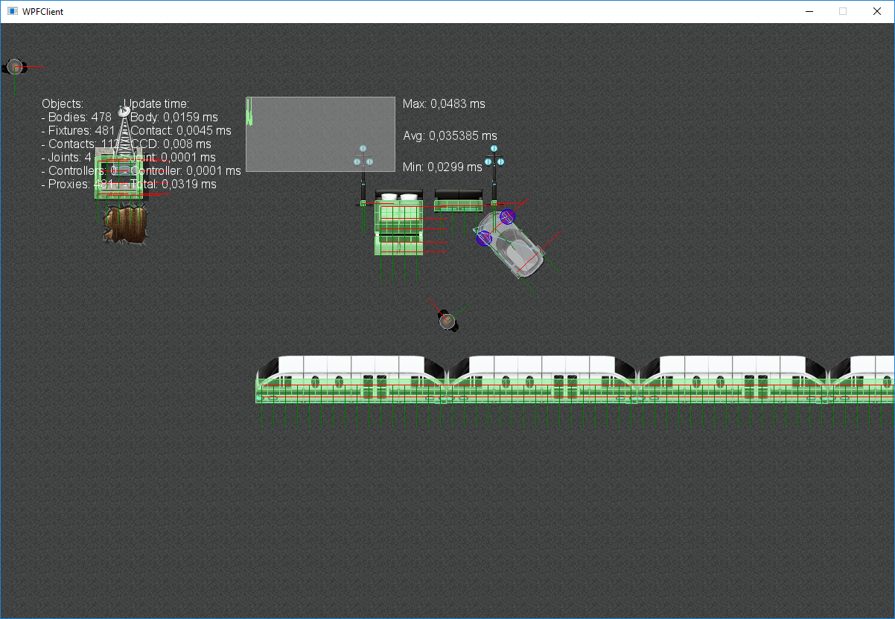 | 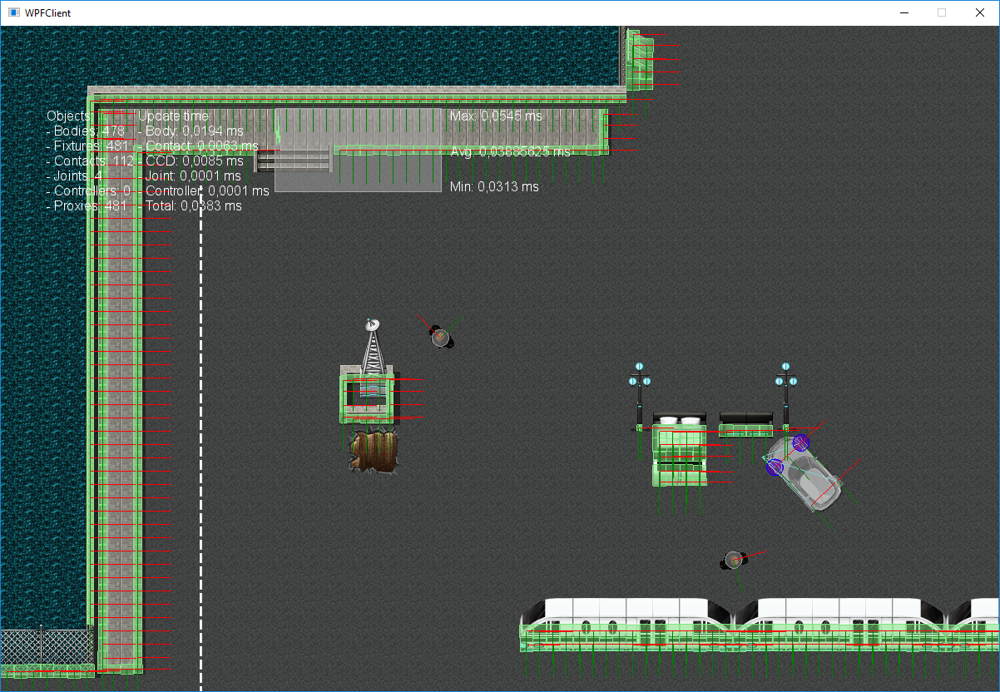

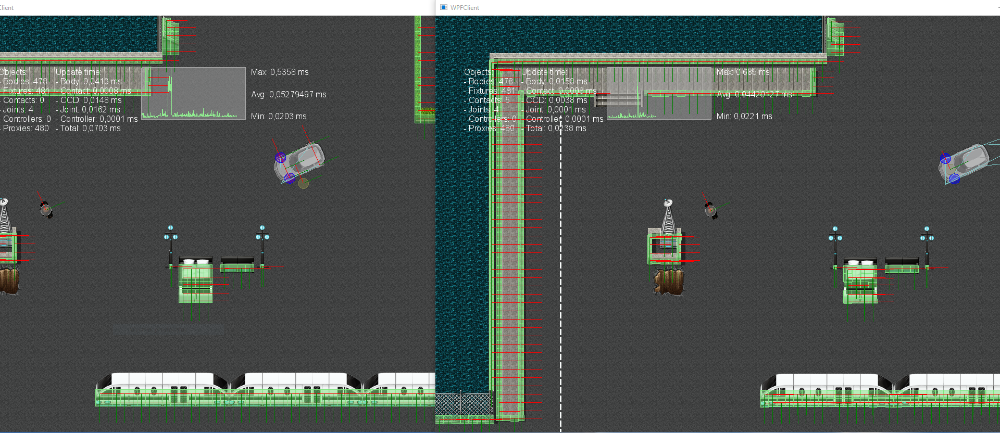

### Server

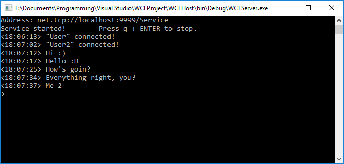

## Class Diagram

### WCFReference

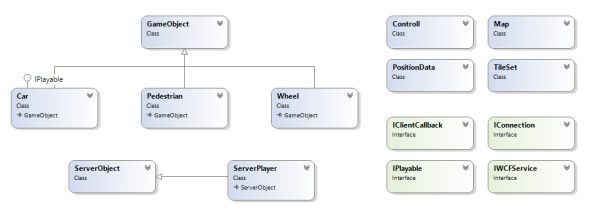

### WCFClient

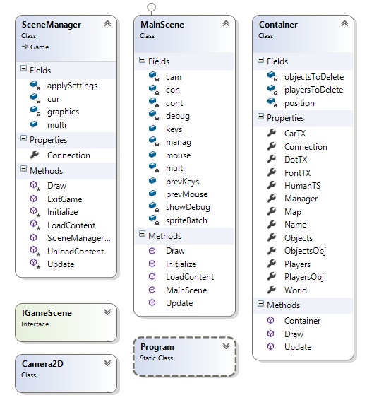

### WCFReference

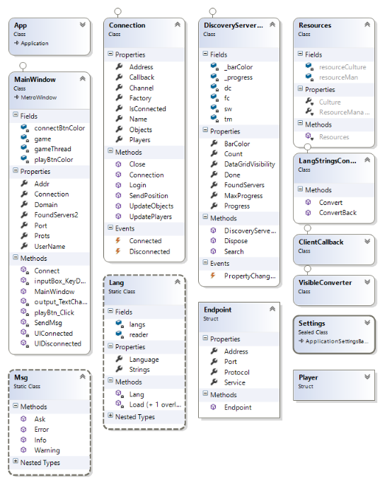
